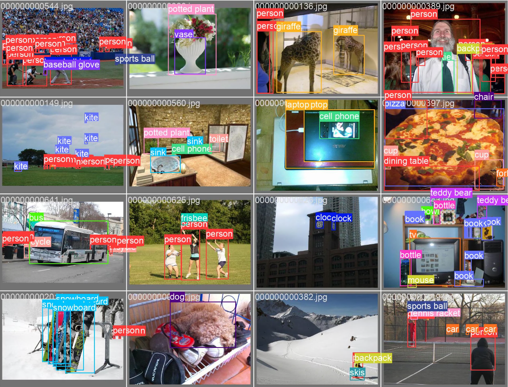

# YOLOv5 在幻方萤火集群上的训练优化

简体中文 | [English](./README_en.md)

幻方 AI 在萤火集群上对 [YOLOv5](https://github.com/ultralytics/yolov5) 进行了训练优化，通过自研的 [3FS](https://www.high-flyer.cn/blog/3fs/)、[数据集仓库](https://www.high-flyer.cn/blog/hfai_datasets)、[hfreduce](https://www.high-flyer.cn/blog/hf-reduce) 多卡通信、[算子](https://www.high-flyer.cn/blog/hfnn)等优化工具，实现了近 50% 的训练提速。


+ 技术博客：

## Requirements

- [hfai](https://doc.hfai.high-flyer.cn/index.html)

## Training

通过 [hfai](https://doc.hfai.high-flyer.cn/index.html) 工具提交任务至萤火集群，使用4张显卡训练：

```shell
HF_ENV_NAME=py38-202111 hfai python train.py -- -n 4 --name train_yolov5
```

集群的默认环境 `202111` 已经集成了训练所需的依赖。


## Dataset

[hfai 数据集仓库](/public_dataset/1/ffdataset/COCO/)集成了 COCO 数据集，可以访问集群地址 `/public_dataset/1/ffdataset/COCO/` 获取 [FFRecord](https://www.high-flyer.cn/blog/ffrecord/) 格式的高性能训练样本数据。

使用方式如下：

```python
from hfai.datasets import COCODetection
from ffrecord import FileReader
from ffrecord.torch import Dataset, DataLoader

class LoadImagesAndLabels(Dataset):
  def __init__(self, ...):
    self.data_dir = COCODetection('train').data_dir
    self.reader = FileReader(self.data_dir / "train2017.ffr", check_data=True)

    ...

```

训练效果：

