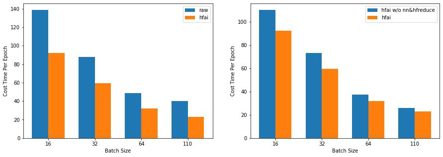
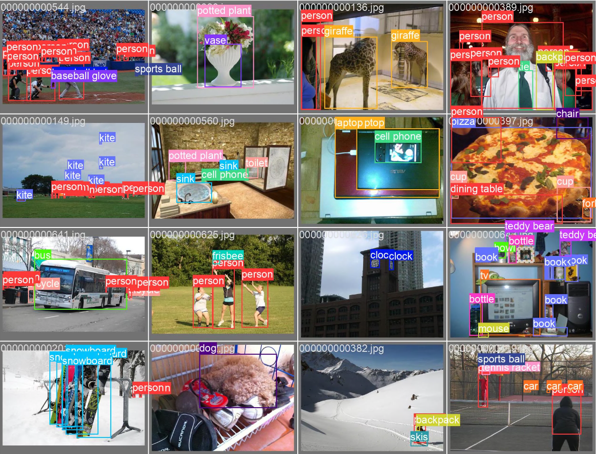

# YOLOv5 improved by High-Flyer

[简体中文](./README.md) | English

High-Flyer AI achieved 50% increase in [YOLOv5](https://github.com/ultralytics/yolov5) training, with the help of [3FS](https://www.high-flyer.cn/blog/3fs/), [dataware](https://www.high-flyer.cn/blog/hfai_datasets), [hfreduce](https://www.high-flyer.cn/blog/hf-reduce) and [hfai.nn](https://www.high-flyer.cn/blog/hfnn). 



## Requirements

- [hfai](https://doc.hfai.high-flyer.cn/index.html)

## Training

submit the task to Yinghuo HPC：

```shell
HF_ENV_NAME=py38-202111 hfai python train.py -- -n 4 --name train_yolov5
```

The required dependencies have been integrated in cluster environment, `202111`.


## Dataset

[hfai dataware](/public_dataset/1/ffdataset/COCO/) intergrates COCO dataset, the [ffrecord](https://www.high-flyer.cn/blog/ffrecord/) file of which can be accessed in `/public_dataset/1/ffdataset/COCO/`.

```python
from hfai.datasets import COCODetection
from ffrecord import FileReader
from ffrecord.torch import Dataset, DataLoader

class LoadImagesAndLabels(Dataset):
  def __init__(self, ...):
    self.data_dir = COCODetection('train').data_dir
    self.reader = FileReader(self.data_dir / "train2017.ffr", check_data=True)

    ...

```

